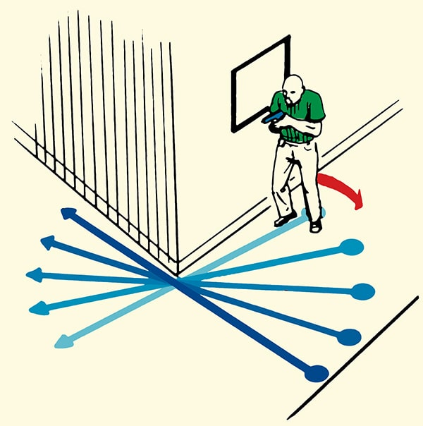
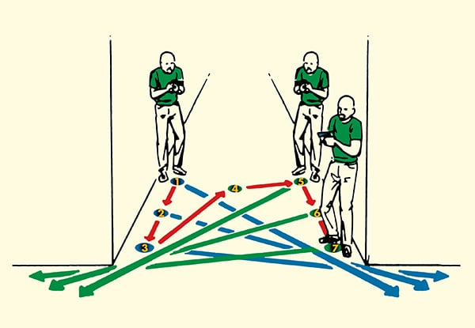
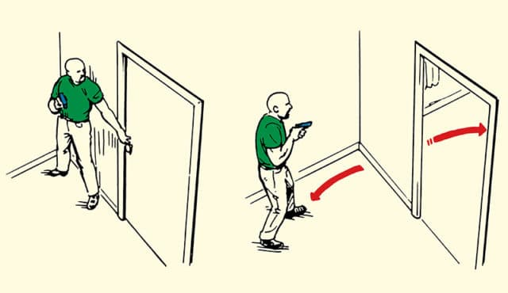
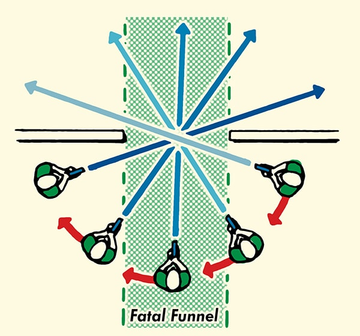
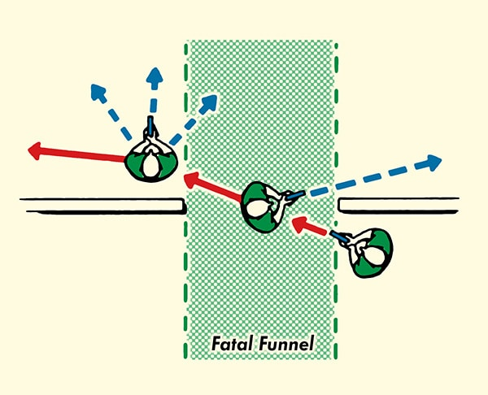
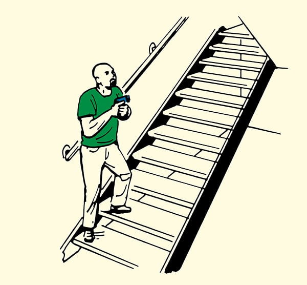

# A Rat's Life — Solo Tactics Field Manual
The Ultimate Guide to Stealth, Sabotage, and Solo Operations in Arma Reforger or any large-scale FPS of your choosing.

TEST
## FOREWORD

Welcome. If you're reading this, you're ready to learn the ways of the Rats — a brotherhood of players who master the art of lone wolf, commando-style sabotage in large-scale tactical shooters. If you enjoy playing squad-based games largely on your own for whatever reason, and enjoy sneaking around causing trouble, then this guide is for you. I will show you how to operate solo in large-scale shooters while still positively contributing to your team and the game state. In fact, applying these tactics well will make your solitary vermin-adventures worth more than a handful of hapless squaddies.

Solo players are underserved when it comes to guides in tactical shooters. While squad tactics dominate most guides, this handbook fills that crucial gap for those of us who prefer to chill on our own in games. Whether you're a dedicated Rat, a separated squad member, or simply looking to sharpen your solo skills, you'll find everything you need to make a decisive impact while operating alone in Arma Reforger and similar large-scale FPS games.

The tactics within this guide draw from declassified infantry manuals, which I have adapted specifically for the reality of gaming. For example: real-world doctrine tells soldiers to use SLLS: Stop, Look, Listen, Smell when patrolling. Since Arma Reforger lacks smellovision, I've streamlined this to SLL: Stop, Look, Listen. Throughout this guide, you'll find similar practical adjustments that bridge the gap between real-world doctrine and our virtual escapades.

You'll note that the infantry manuals you can find online are almost exclusively dedicated to squad operations. Even snipers work in teams. The challenges we face as solo operators in Reforger are rarely documented. So I've stripped down squad tactics to their solo essentials, borrowed concepts from other military disciplines, and pressure-tested everything in actual gameplay over two decades of being a sweaty Rat.

— toast

### CHANGELOG
This guide is written to be iterated and improved upon. My long-term goal is to have this be THE comprehensive tactical guide for solo players in tactical games akin to Arma Reforger, with a focus on stealth, sabotage, subterfuge and generally sneaky, annoying tactics, hence the name 'Rat'.

You can follow the development of the guide here:
https://github.com/verybadracer/arma-reforger-tactical-manual 

v1.0 -

#### PLANNED UPDATES

- Vehicle Tactics
- Hit box diagrams for all vehicles

#### Suggestions?

If you have any suggestions on topics or tips to add from your Rat operations, please comment them below or into the discussions on GitHub. If your ideas are implemented into the guide, I will credit you in the new version of the guide.


---

# I. RAT DOCTRINE & MINDSET

## What is a 'Rat'?

**“Rat”**: the name captures the spirit of how we operate and how we are perceived. We call ourselves Rats because we are meant to be hated. We are vermin in the enemy's rear, chewing through their resources, ambushing their friends and vanishing before they can retaliate. When they do catch us, we reappear just as quickly as we were exterminated, ready to annoy again.

In Arma Reforger, “Ratting” is the art of operating deep behind enemy lines, fulfilling the role of a commando or saboteur. The Rat acts largely alone or in small cells, leveraging sabotage, ambushes, theft, and nuisance to destabilise and harass enemy forces. Their goal is not to seize territory by force of arms, but to erode enemy logistics, morale and operational coherence through persistent, unpredictable harassment.

Basically — be as annoying and destructive as you can without being seen and without dying.

We are the single operator who distracts large amounts of resources from the enemy into dealing with you rather than winning the game. Rats do not fight fair, ever. They lurk in the shadows, strike without warning and disappear before the enemy can comprehend what has happened.

Rats have received their namesake in part because their playstyle demands scavenging. They live off the battlefield, arming themselves with whatever they can recover from the dead, whether by their hand or someone else's.

Your enemies will curse you. They will call you cowards. At that moment when you hear their frustration spill out over Platoon chat on a radio you stole from one of their own, you will know you're doing your job right.

The term 'Rat' as we know it currently came from Escape from Tarkov (see seminal educational video — [https://youtu.be/o286LaBz__Y](https://youtu.be/o286LaBz__Y)), but the philosophy has since spread far beyond.

This is what Rats do.

Rats deploy themselves to the battlefield and engage in clandestine operations to disrupt the enemy, this includes:

- Disrupting enemy supplies by stealing, destroying or sabotaging enemy vehicles, ambushing supply lines, mining roads and wasting resources at enemy arsenals.

- Delay or destroy reinforcing enemy forces through ambushes and route denial.

- Disrupting enemy operations by ambushing or sabotaging high-value vehicles like helicopters and tanks.

- False flag operations using enemy uniforms for infiltration and ambush (but beware of XP penalties in Patch 1.3).

- Radio theft and psychological operations — stealing enemy radios to monitor communications and, where permitted by server rules, broadcasting on enemy frequencies to sow confusion and chaos (without being abusive).

- Locating and destroying enemy radio backpacks to eliminate their mobile spawn points.

- Force the enemy to overcommit resources like manpower, vehicles, and time to deal with an elusive, low cost vermin-like threat.

- Solo-cap objectives and while doing so, deconstruct base assets to frustrate enemy efforts and waste their supplies

- Solo-cap objectives and force the enemy to waste resources to deploy to the point to prevent the objective being lost.

- Entering enemy bases and using their arsenals to waste their supplies by buying items and dropping them in the vicinity nearby.

- Maintain continuous psychological pressure by frustrating the enemy team wherever possible.

- Any other mischief the Rat sees fit to employ, provided it is within the rules of the game and advances his team's ability to win the game.

## The Psychology of the Effective Rat

A Rat must reject the conventional battlefield ego of the average FPS player. This playstyle is not for those who seek glory, heroic last stands, or kill counts for their own sake.

The Rat embraces cowardice as virtue. Running without shame. Hiding without honour. Striking only when victory is certain. This mindset demands total suppression of the ego that drives most players to “prove themselves” in fair fights.

To Rat effectively, you must prioritise survival above all else. Each spawn costs precious supplies — whether through vehicles or radio backpacks. Death is failure, not sacrifice. The dead Rat disrupts nothing.

**The Rat thinks constantly.** Too many players spawn, kit up, jump in a vehicle, and drive blindly toward their objective only to be annihilated on the way. This is not Ratting; this is feeding. Every movement demands consideration: Which routes avoid likely ambush points? Where might enemy Rats be operating? What escape routes exist if contact is made? The thoughtless Rat is a dead Rat.

**The Rat maintains purpose.** Sneaking around an objective outside radio range serves no one. Hiding in a bush 2 km from anything of strategic value is not infiltration — it's desertion. Before every action, ask: “How does this help my team win?” If you cannot answer, you are not Ratting. Every position must threaten something the enemy values or enable something your team needs.

Rats do not fight fairly. They do not engage unless holding an overwhelming advantage. When surprised, they flee immediately. When cornered, they evade. There is no shame in retreat, only in unnecessary death.

Like their namesake, Rats survive through cunning, not courage. They scavenge, they hide, they strike from shadows. This is not a playstyle for those seeking respect or admiration. Your enemies will hate you. Your teammates may question you. But results will speak for themselves.

Your team may celebrate their successful push, but you'll know it was your ambush on that reinforcement truck that tipped the scales.
## Operational Philosophy: High Impact, Low Visibility

While psychology governs the Rat's mindset, operational philosophy guides their tactical decisions. The principle is simple: maximum disruption with minimum exposure.

This requires ruthless prioritisation. Random kills and aimless wandering wastes time and resources. Every action must advance strategic objectives that weaken the enemy's ability to win.

Effective target selection demands map awareness and predictive thinking. Consider likely supply routes, identify reinforcement patterns, and locate critical objectives. Flipping the right objective can cut off half the map from comms. An ambushed supply truck can starve a forward position and prevent the enemy respawning to defend. A well set ambush position can provide the buffer your team need to cap a point.

Consider: that enemy helipad might be a tempting target, but is it currently active? That sniper might be an easy kill, but are they actually affecting the battle? The disciplined Rat constantly evaluates:

- What target offers maximum disruption?
- Where is the enemy most vulnerable?
- How can one action cascade into multiple problems?

When priorities shift, the Rat adapts immediately. Clinging to outdated objectives is tactical malpractice, if you haven't seen any enemies in a while, then it's time to move. Thanks to radio backpacks, relocation is simple. When conditions change, pack up and redeploy without hesitation.

A single Rat, correctly positioned and properly focused, becomes a force multiplier.

**This is the way of the Rat.**


## How Patch 1.3 Changes the Ratting Meta

Patch 1.3 fundamentally altered disguise operations. Previously, Rats could wear enemy uniforms and engage targets without penalty and still grind XP. 

The new system tracks what you are wearing and which team you're dressed as. Kill while wearing enemy colours and you receive an increased friendly fire penalty. You will be demoted through the ranks, ultimately reaching _Renegade_ status. Renegades lose all arsenal access to **any** arsenal, friend, or foe. This is important because a Rat may rely on the enemy arsenal in bases they sneak into to resupply from, reducing them to pure scavengers. Some servers will also kick Renegade ranked players automatically.

Nametags have also been buffed in that they now appear when players are using binoculars, meaning it is much easier to spot someone in disguise than it used to be — this means the meta of hiding in plain sight is now basically dead.

**Disguises remain viable — but require new discipline:**

- Use for passive infiltration only.
- Avoid combat while disguised.
- If you are going to carry out ops in disguise, accept the XP loss.

These changes mean the era of Ratting in disguise is mostly out of the window and the new golden era of Ratting begins.

---

# II. FIELDCRAFT
> “If the enemy can see you, and you are within range of his weapon system, he can engage and possibly kill you. So, you must be concealed from enemy observation and have cover from enemy fire. When the terrain does not provide natural cover and concealment, you must prepare your cover and use natural and man-made materials to camouflage yourself, your equipment, and your position.”
> 
> The Warrior Ethos & Combat Skills

The use of concealment and cover is an essential infantryman technique that has kept soldiers alive for hundreds of years. Rats, as solo operators out in the field, literally live and die by their aptitude to identify and stick to proper cover and concealment.

## 1. Utilising Cover and Concealment

Cover protects you from enemy fire. Concealment hides you from enemy observation. Neither guarantees both.

Natural cover includes terrain features like rocks, hills, and trees. Man-made cover includes trenches, sandbags, and vehicles. When the terrain offers neither, camouflage becomes your only option — match your uniform and equipment to the environment.

Concealment in Arma Reforger consists mainly of bushes, grass, and shadows. 

**There's a catch:** grass and shadows render at player-defined distances for performance reasons. While you're lying “concealed” in tall grass, enemies with low graphics settings see you sprawled in open ground. This affects most tactical shooters, not just Reforger.

***Assume all grass is invisible — it is useless to you as concealment!***

Some games force shadow rendering, but grass remains optional. You can't rely on vegetation for concealment. When in doubt, use hard cover or terrain depressions instead.

### Silhouette and Skylining

Silhouetting / Skylining occurs when a Rat’s outline is visible against a contrasting background, making detection likely even at a distance. Moving across open ground without cover creates a distinct shape the enemy can easily spot. Skylining is a specific form of silhouetting that happens when a Rat moves along the crest of a hill or ridge. Against the lighter sky, the body forms a clear, dark outline, presenting a perfect target.

To avoid this, Rats must move below the tops of hills and ridgelines whenever possible, staying against broken backgrounds such as vegetation or uneven terrain. Pausing on high ground must be avoided; even brief exposure can betray a Rat’s position. Darkness offers no protection — figures against the night sky remain easily visible.

A Rat who fails to control their silhouette will be seen. A Rat who is seen will be killed.

### Camera View, Posture, Concealment, and Cover

Arma Reforger's multiplayer servers can be set up to either only allow first-person gameplay or to support both first- and third-person perspectives. Always check the view setting that is being used when you join a server. You can do this by pressing the mapped change perspective key or button. If the view switches from first to third person, you are on a third-person server; if you are unable to switch back to the third-person view, you are on a first person server. What you can do in concealment and cover will be affected largely by the view modes available to you.

Some players prefer to use first-person view exclusively. Others will take full advantage of third-person mode and play in a hybrid of 1pp and 3pp (1st / 3rd Person Perspective). The most significant advantage of third-person view is **third-person peeking**, that is the ability to see over or around cover without exposing your body. This provides a clear field of vision while denying the enemy the opportunity to engage. In terms of tactical leverage, this is considerable.

Rats do not fight fair. If the server allows third-person view, you are expected to use the third-person peek. Every player on the server has access to the same tools and, especially on consoles, the vast majority of players will be doing the same thing. Choosing not to use third-person peeking when it is available is a self-imposed handicap.

**Posture Controls** are a critical component of concealment and visual discipline. In Arma Reforger, you can adjust your character’s stance incrementally using the Control key and scroll wheel. Each base stance, standing, crouching and prone can be fine-tuned through several sublevels, like this:

```
STANDING    ┌─ Level 5 (tallest)
            ├─ Level 4
            ├─ Level 3
            ├─ Level 2
            └─ Level 1 (lowest) ← Best for 3PP peeking

CROUCHING   ┌─ Level 5 (tallest)
            ├─ Level 4
            ├─ Level 3
            ├─ Level 2
            └─ Level 1 (lowest)

PRONE       (Single height only)
```

**The Golden Rule: Go as low as possible while keeping the camera advantage.**

Simply — you should configure your character to be as low as possible while still maintaining the camera height benefits of the stance 'mode' you are currently in. The **standing stance** provides the highest third-person camera elevation, offering the broadest field of view. However, this also exposes the largest silhouette and target for the enemy. By adjusting your posture to the **lowest possible setting within the standing stance**, you retain the high camera perspective while significantly reducing your visible profile. This allows you to observe your surroundings from cover with reduced risk of exposure.

The crouched, and prone postures offer reduced height and improved concealment, but with corresponding decreases in mobility and camera elevation. In third-person view, the camera lowers as your posture changes from standing to crouched to prone, reducing your observational advantage.

When moving, remember **that your character keeps its height setting when you stop — unless you switch between standing/crouching/prone, which resets it to default.** That means if you are in a low crouch when you sprint crouch from cover to cover, when you stop, your character model will resume at the 'level' you were at before you moved.
### Hiding in Bushes

Bush concealment is fundamental in Arma and a trick as old as time. As a Rat you will depend on hiding within bushes on a very regular basis to go unseen. Often, hiding in a bush concealment in plain view of the enemy is safer than hiding behind cover in terms of not being detected. Both Russian and American uniforms blend well with Reforger's foliage, especially the US disruptive patterns.

Two factors determine success: positioning and camera control. This technique works on both server types but excels in third-person for the obvious reasons.

**Basic Technique:**

1. Enter bush and crouch — provides the best balance of concealment and visibility.
2. Lower your stance further with Ctrl + scroll wheel.
3. Aim weapon downward to tuck your profile into foliage.
4. Double-tap Left Ctrl for weapon low-ready (reduces barrel exposure).
5. Hold Alt for free look (observe without moving).
6. Double-tap Alt to lock free look for extended observation.

**Third-Person Advantages:** Crouching in 3PP keeps your camera elevated above foliage while your body stays hidden. In 1PP, you only see what your character sees, so you have to give up concealment for the sake of visibility.

**First-Person Considerations:**

- Position deep enough that foliage obscures your upper body and partially obscures your view, that way you know your chest / weapon are not sticking obviously out of the brush.
- Accept some visual obstruction — clear view means you're exposed, branches and leaves should be in your way.
- Be more mindful of your weapon barrel and where it is sticking out, adopting the low ready position can help.

**Tactical Trade-offs:** If lowering your weapon to improve concealment just bear in mind it leads to a reactionary gap. In low-risk areas, prioritise concealment. In high-risk zones, keep weapon ready despite the larger profile.

**Key Warnings:**
1. Prone positioning often exposes legs beyond the bush edge, particularly to flanking enemies hence why crouching is almost universally better.
2. Your weapon barrel can betray your position even when your body is well-concealed. 
3. Remember that bushes provide no protection from incoming fire — they hide you, they don't shield you. 
4. Your concealment needs will vary depending on your mission: total invisibility for reconnaissance may require accepting heavy visual obstruction, while ambush positions demand a balance between concealment and clear firing lines.

Hiding in bushes will allow you to hide in plain sight, often, the enemy will not see you until they are literally standing on top of you. I have had players walk over me in foliage and still not know I am there (somehow).
### Actions as Concealment

Rats can do a lot to help their stealth capability by being wary and mindful of their actions and how they might give them away. Light discipline means not using your torch, turning off headlights on your vehicles and so on.

Most gaming monitors have a gamma or night vision capability, and this is how the majority of players can see at night.

Rats don't fight fair, neither does anyone else, if you have it, you should use it.

**Noise** — Any form of movement makes noise, in the current state of the game you *speed* dictates how loud you are, the slower you are, the quieter you are. **Your posture / stance does not affect how loud you are currently!** Bear that in mind.

Vegetation and terrain features such as bushes, undergrowth, and branches aggravate movement noise, with snapping twigs or rustling foliage revealing a Rat’s approach long before they are seen. 

If you are operating near enemies, you need to mask your sounds, or you will be compromised and you will die. Time your movement with other in-game sounds to help mask the sound of you moving. Move when the enemy is moving, firing, talking on their radio, or the wind is blowing through the trees and foliage.

**Radio Comms** — Talking in prox. chat is obviously going to give you away, but bear in mind that when you **talk on your team / squad radio, your character will also talk in prox. chat** as you would expect to happen in real life.

**Totally silent faction / squad chat** is achievable by using the text chat function on PC, to get messages to your team with your character model remaining completely silent. Just make sure you're not typing into global chat!

**Movement discipline** — Do not move without having a reason to move and a plan of where you are going and what you will do if you are suddenly compromised. Motion invites observation and creates noise, the human eye is naturally attracted to movement and gamers finely tuned to the sound of footsteps. If you have to move, continue using cover and concealment, crossing open ground must be avoided unless you have literally no other choice. If you *must* walk across open ground, time it well, move as quickly as you can and try to use 'dead ground', which is an area of terrain where natural dips folds or obstacles obscure enemy sight of you.
### Why Rats Get Seen

Despite following the principles of cover and concealment Rats are often still seen and exterminated in the wild. This is because Rats misunderstand concealment. Staying hidden relies on you applying the principles we have covered in this section in combination with understand **how your enemy will see you.**

**Visual detection** is the primary threat to solo operators. The enemy does not need to see your entire body or gear, they only need to spot one small thing that does not belong. A shape that breaks a natural pattern, a shadow where none should fall, a flick of movement in the stillness.

Some things to consider:

**The human brain is an expert in pattern recognition**. It knows what to expect on maps like Everon. Empty buildings. Abandoned vehicles. Deserted roads. When everything should be lifeless, any sign of movement or presence triggers immediate attention. This is why a helmet edge in a window draws your eye from hundreds of meters away. It violates the expected pattern. Choose positions that match the context of the environment you are in.

**Movement is your greatest enemy.** The human eye glosses over static shapes but locks onto motion instantly. You can remain invisible at 50 meters until you shift position, then get spotted at 300. Even turning your head creates detectable change against a still background. This creates the Rat's dilemma: movement is necessary for mission success but deadly for concealment. Time your movements, plan your escape vector, movement discipline is key to your success.

**Shadows conceal, but they also betray.** You can third-person peak from behind the corner of a house all you want. Just remember, if the sun is in the right position, your long shadow on the ground is giving you away and the enemy is looking to flank you. Be wary of the changing light conditions and how they affect your concealment.
### Fighting Positions / Hides / Ratholes

A hide is a static position from which the Rat will observe from, engage from if necessary, and fall back to survive. A hide is a deliberate spot selected by you in your area of operations, and the use of such pre-determined hides can be a key element to remaining undetected or surviving if compromised.

When selecting a hide, even a temporary one you only intend to use for a few moments or minutes — you must briefly consider the following factors.

**Selection Standards** — The ideal hide provides a clear field of fire while wherever possible denying the enemy a clean shot back. A second floor window overlooking a crossroads allows engagement while the walls offer protection, for example. A hillside position looking down into an exposed piece of road is an ideal hide.

**Escape Planning** — You need to know how you are going to escape your position if you are pushed by the enemy, remember, Rats are cowards do not go down in blazes of glory if they can help it. Do not allow yourself to be cornered. When picking a hide you need to briefly think 'What am I going to do, where am I going to go, if this position is compromised?'


# 3. MOVEMENT

Movement is necessary, but undisciplined movement invites detection and destruction. Movement is a constant exercise in judgment, terrain reading, and restraint.

Successful movement relies on strict adherence to basic principles:

Stop, look, and listen (SLL) before moving and after moving. Identify your next position and plan your route before leaving cover, when you arrive, stop, look and listen again for 10 - 30 seconds before departing once more. Movement without a plan risks crossing open areas, exposing your silhouette, or creating unnecessary noise.

Whenever possible, select routes that offer natural cover and concealment. Move through low ground, vegetation, depressions, and broken terrain. Avoid walking across cleared areas or the tops of hills and ridgelines. Movement along elevated ground will skyline your silhouette against the sun or moon, making you visible from great distance.

Remain alert to environmental cues. Birds or animals that suddenly scatter may indicate the presence of enemy forces nearby. Pause, observe, and adjust your movement accordingly.

When crossing danger areas such as roads, trails, or riverbeds, choose crossing points with the most available cover such as low spots, culverts, curves, or bridges rather than open straightaways.

Movement must be adapted based on the likelihood of enemy contact. The following guidance applies:

|If Enemy Contact Is:|Move By:|
|---|---|
|NOT LIKELY|Walking / Running / Driving|
|POSSIBLE|Walking / Running, with frequent Stop / Look / Listen pauses|
|EXPECTED|Walking only, maximum Stop / Look / Listen discipline|

Movement is a constant risk. Your ability to move silently, unseen, and intelligently determines your survival. Rats do not rush blindly. They move with purpose or they do not move at all.
### Moving From Cover

If you have been firing from one position for some time, the enemy may have spotted you and may be waiting for you to come up from behind cover. So, before rushing forward, roll or crawl a short distance from your position. By coming up from another spot, you may fool an enemy who is aiming at one spot and waiting for you to rise. When the route to your next position is through an open area, use the 3 to 5 second rush (detailed in the next chapter). When necessary, hit the ground, roll right or left, and then rush again.
### The 3-5 Second Rush

The rush is the fastest way to move from one position to another. Each rush should last from 3 to 5 seconds. Rushes are kept short to prevent enemies from tracking you. However, do not stop and hit the ground int he open just because 5 seconds have passed. Always try to hit the ground behind some cover. Before moving, pick out your next covered and concealed position and the best route to it.

# 4. URBAN COMBAT

Arma Reforger has some small urban areas and the principles of urban movement and combat do apply here. Successful Rat operations in urban areas requires skills that are unique to this type of fighting. You must be skilled in moving, entering buildings, clearing rooms and selecting and using fighting positions to be effective in this environment.

### Avoid Open Areas
Open areas such as streets, alleys and parks should be avoided, they are natural kill zones for your enemy and their snipers. They can be crossed safely with the use of smoke or the 3 - 5 second rush.

### Move Parallel to Buildings
You may not always be able to use the inside of buildings as routes of advance and may be forced onto the outside of buildings. You should move parallel to the side of the building along the building line. Stay in the shadows if you can, present as low a silhouette as you can while still moving rapidly to you next position. 

### Moving Past Windows
Windows present a hazard to the rat and the most common mistakes are exposing the head and chest in a first floor window to the enemy. Where possible stay below the window level and near the side of the building while ensuring you do not silhouette yourself in the window. 

### Moving Around Corners
Corners are natural choke points and ambush zones. Entering them carelessly is fatal. The most common mistake a Rat can make is exposing their weapon barrel or full silhouette around a corner without first clearing it. If an enemy is waiting with their weapon trained, even a brief exposure results in death.

Do not approach a corner too closely. In most modern FPS, getting too tight to the wall will cause your character to raise their weapon into a non-ready position. Though it will snap back into place when you step out, the reaction delay can cost you your life. Always maintain a slight offset from the wall so your weapon remains ready.

Wherever possible, you should 'pie' the corner. Pieing is a deliberate clearing method where you slice the angle gradually in controlled steps, like slicing a pie. Instead of swinging wide and out of the corner exposing yourself, you move in wide arc, exposing only a narrow segment of the new area at a time. This method gives you a shifting field of view while keeping your profile small. Done correctly, pieing the corner allows you to clear unknown threats without over-committing. Your weapons remains in the ready position and your movements are controlled.

However, if you already know the enemy's position because you've seen movement, heard a reload or spotted something that gives the enemy away, then you should not pie. You should pre-fire the corner.

### Clearing T Shaped Corners
T-shaped corners are among the most hazardous terrain features in any structure. You cannot see left or right until you expose yourself — and an enemy could be lying in wait on either side, already aimed in.

Most players commit blindly to one side and die for it. The smarter Rat slices both arcs gradually, exposing just a sliver of each sector in turn, as shown below:


This method lets you clear both corners incrementally before fully committing. It won’t make you bulletproof, but it massively reduces the chances of walking into a static ambush.

Once you've reached the decision point and must step into the junction, **do not hug the wall**. Defenders will almost always hold the closest edge. Instead, cut a **wide arc** away from the wall, forcing the enemy to adjust their aim and giving you a reactionary gap. That split second can decide who wins the fight.
### Pre-Firing A Corner

Pre-firing a corner is a deliberate offensive technique used in close-quarters engagements where the enemy’s position is known with confidence. It is particularly effective when the target is isolated and unlikely to be supported by additional contacts.

The method involves engaging a pre-identified location before fully exposing oneself beyond cover. To execute a pre-fire, align your weapon sights on the suspected enemy location, begin lateral movement away from the cover, and initiate fire just before crossing the visual threshold of the corner. Initial rounds may impact the wall or cover, but as the shooter clears the corner, rounds should fall directly on target.

This technique exploits network latency and peeker’s advantage inherent in online environments. When timed correctly, it allows the shooter to place rounds on the enemy before the enemy’s client registers the shooter's full exposure. From the enemy's perspective, it may appear as though they were eliminated before the shooter was fully visible.

Pre-firing is not speculative. It is a calculated strike against a confirmed or highly probable threat location. When combined with accurate shot placement and decisive movement, it gives the solo Rat a critical edge in first-contact engagements.

### Entering a Building

Conventional infantry doctrine advises against entering buildings through doors or windows whenever possible, preferring to create new entry points with demolitions, breaching charges, or tank rounds. Arma Reforger does not simulate this kind of structural destruction, and you are limited to climbing through appropriately sized windows or using the door.

That means, more often than not, you’ll be using doors and that’s a problem, because that’s where defenders will be waiting.

**If a window is available and accessible, you should always use it instead.** Most players expect door entries. The element of surprise from entering via a window, even with the noise of the glass breaking, gives you a critical reaction gap. That gap is often enough to kill whoever is covering the obvious angle.

If circumstances allow, **precede your entry with a grenade**. The explosion will force defenders into cover or out of their sights, disorient them, or outright kill them. Either way, the Rat must enter **immediately** after detonation. Any delay forfeits the advantage and gets you shot walking into the kill zone.

Do not linger at the threshold. Move, clear, and kill. This is not the time to hesitate.

# 5. CLOSE QUARTERS COMBAT (CQC)

CQC represents the most volatile, unforgiving and lethal form of engagement available to the Rat, or any soldier for that matter. It occurs inside buildings, confined spaces or within narrow urban terrain areas. In these areas visibility is is limited, movement constrained and combat takes place at distances measured in metres or less.

If you are entering a building to clear it of a known threat, this is CQC. If you are being rushed by an enemy while you are hiding in an bush on the outskirts of a base, this becomes CQC.

Any combat that occurs in close quarters is CQC. I know this sounds obvious but knowing when to apply the below principles will help you survive.

In real-world doctrine, CQC is universally recognised as high-risk. In Arma Reforger, it becomes exponentially more dangerous due to several factors including client-server latency, clipping and occasionally de-sync.

Even with perfect technique, the odds in CQC favour the defender. Any player holding a corner or angle already has their weapon raised, often aimed at the doorway. They enjoy the luxury of cover, positioning and time. The Rat, by contrast, must breach, identify and engage all while exposed.

It is for this reason that it is almost universally recommend in nearly all circumstances to simply hold an overwatch of a known occupied building, and wait out the occupant or take a shot through the windows. It is also recommend to simply bypass the building altogether if an enemy is known to be occupying it, instead moving around its arcs of fire and waiting for the enemy to leave again.

There are only two scenarios where CQC may become necessary:
1. An enemy unexpectedly occupies the same structure or terrain as you.
2. A known high value threat is inside a building and must be eliminated (a sniper, an enemy Rat, an anti-vehicle specialist)

When these conditions apply, the Rat must abandon hesitation and commit to the doctrine of **overwhelming violence of action**.

### Violence of Action
Violence of action is the defining characteristic of the Rat’s engagements. While stealth, evasion, and deception are the default tools of survival, there comes a moment when the Rat must strike. When that moment arrives, it must be executed with **overwhelming force, speed, and decisiveness**.

**Violence of action** is the sudden application of surprise, aggression, and dominance to seize the initiative and eliminate the enemy before they can react. It is not optional. It is not negotiable. **Hesitation equals death.**

In Close Quarters Combat, the psychology of the engagement matters as much as the tactics. If the Rat hesitates, the Rat dies. Creeping slowly, inching forward, checking every corner with tentative movement these all serve the defender. The Rat must instead force the fight and shatter the defender’s expectations. Time is not an ally. Every second spent pieing a corner or checking a doorway allows the enemy to reposition, reload, heal, or brace for your entry.

The Rat must act with deliberate speed, aggression, and intent. Movement must be assertive. Targets must be engaged the moment they are seen. Time spent in the kill zone must be kept to an absolute minimum.

Pre-firing is the standard operating procedure. If a door is likely occupied, pre-fire it. If a corner is suspect, pre-fire it. If you do not have the ammunition to pre-fire your entries, you do not have the ammunition to conduct a CQC assault and should abort.

**If you still have a grenade in your inventory and are about to breach a suspected occupied room, use it.** If you're about to enter a room you suspect is occupied precede the breach with a grenade and go in immediately after detonation. The Rat does not linger, go in fast, aggressive and loud while the enemy is still disoriented or dead.

Pre-fire doorways and angles using short, controlled bursts. Do not waste ammunition spraying wildly. The goal is suppression and reaction delay, not panic fire.

CQC requires tempo dominance. The Rat must move faster than the defender can process, forcing mistakes and creating gaps in their response. Most defenders expect a slow breach. When you enter with speed and violence of action, you throw off their rhythm, forcing rushed and inaccurate reactions. Their plan breaks down. Yours takes effect.

If the defender is behind a door and has already revealed their presence—whether by pre-firing, footstep noise, gear movement or voice comms—listen for signs of **dead time**: reloading, healing, opening the inventory, switching weapons or speaking. These are your windows. The moment you hear any of them, breach and shoot. Do not wait. Do not hesitate. If you delay, they will recover, and you will die.
### How to Clear Doors

Clearing a door is one of the most dangerous actions a Rat can take in CQC. Every doorway is a potential choke point, a bottleneck where defenders enjoy the greatest advantage. This zone is known as the fatal funnel, a narrow area in and immediately beyond the doorway where all incoming movement is focused and where defenders will distinctively aim.

The Rat must consider every doorway as a know hazard. After pre-firing the door they now have to open it - the picture below advises on the best practice of opening the door:

Much like real life Arma Reforger allows you to open the door side on as shown in the image, depending on the type of door and the hallway the Rat should immediately step back from the door to give space for them to go on to pie the angles in the room. Ideally when pieing the angles into the room you should be as far away from the door as is possible while still maintaining visual contact within so as to reduce your silhouette to the defender. **Do not crouch while doing this, defenders will likely be aiming for your centre mass and crouching lowers your face directly into the sight picture.**

### Slicing the Pie
Once the door is opened, you slice the pie by clearing the interior of the room in small segments without entering. The ideal scenario is that the Rat is able to clear the room without entering the fatal funnel or being forced to breach into the room itself. The Rat moves incrementally along the outer arc of the doorway, slowly revealing more of the room slice by slice, as shown below:

Each lateral movement reveals a new “slice” of the interior, allowing you to scan corners and engage targets before they see you. This technique gives the Rat a fighting chance at spotting an enemy who may be holding an angle but hasn't yet seen your approach.

This method is safest when used from a distance not right up against the doorframe. Being too close limits your arc of vision and increases the likelihood of weapon clipping or poor corner geometry revealing your position. Maintain at least one body’s width back from the threshold to keep your weapon in a ready state and ensure maximum field of view.

If the room is shallow, with poor angles or limited cover, and you can confirm it’s clear through slicing do not enter. There is no tactical value in occupying a cleared space that offers no concealment, no advantage, and puts you at risk.

However, if your pie reveals nothing and corners remain unclear, because of doors that open inward for example, or you visually confirm a threat you have been unable to engage you must either:
1. Pre-fire and breach using overwhelming violence of action.
2. Withdrawn and reassess your approach.

Never, ever 'creep' the final corner, never lean slowly into an uncleared space. 

You are either clearing or you are breaching. Hesitation will get you killed.

Slicing the pie is your first port of call to clear a room, use it to avoid having to engage in CWC if possible, but once the door is open, you are on the clock. Every second you spend standing in the funnel increases your already exceedingly high risk of death.
### Room Entry
Most tactical literature assumes that more than one person is clearing rooms. With two or more Rats, angles can be split, sectors controlled and breaches covered. The Rat however more often than not will be on their own. This means every room entry is a gamble as you expose your body to a potential ambush with no backup to cover your flanks. Breaching a room solo is the most dangerous action you can take in CQC and it should only happen after slicing the pie has revealed a significant portion of the interior.

Room entry begins where slicing ends; when you've cleared every slice of the pie you can from the outside and you now need to breach to clear any remaining blind spots. This is usually the space behind the door, deep corners or anywhere line of sight was occluded dependent on the layout of the room.

The doorway itself, the fatal funnel as we mentioned above, is the killzone where **you** die. It is where the defenders are most likely aiming. The longer you are there the higher your chance of death, once you commit to a room breach, you must move immediately, quickly and decisively.

As the image shows, the Rat selects an entry vector that aggressively slices away from the most likely threat position. This usually means entering at an oblique angle sweeping wide away from the doorframe while aiming into the uncleared corner. Doors that open into the room you are clearing may have enemies hiding behind them. If you've sliced the rest of the room this is usually the final blind spot and it is where you must go first.

Once inside, pivot rapidly to cover the angles as you move. Do not stop inside the room unless it is clear, motion is a potent defence in these situations. Hesitation and delay gives a waiting defender time to correct their aim.

Once a room is clear, get out and do the next one.
### Clearing Stairs

Stairs, much like the rest of CQC movement are incredibly dangerous places for the Rat to find themselves if a defender is possibly within the building and potentially defending the staircase. They are vertical funnels with zero cover, limited movement options and any movement up or down them is incredibly predictable.

In squad doctrine staircases are handled with mini bounding overwatch movements and splitting angles. For the solo Rat however none of that exists. You either creep up slowly as most players do and get blasted the second your helmet enters the frame, or you rush.

The correct approach is to pie the base of the stairs first, for any persons stood on the first landing if there is one and then **rush**. Violence of action on defended stairs is a necessity and is your only chance out of your already slim chances of survival, I reiterate that if at all possible you should avoid having to clear an occupied building.

You rush stairs because defenders are likely holding an angle that will have your head in it the moment you approach, the defender is relying on your slowly creeping up so they can shoot the Rat in the face. Do the opposite instead and rush them.

By rushing them you disrupt their sight picture, break their rhythm and will force them to adjust their aim as you barrel towards them. It is during this reactionary gap that you kill or be killed.

### Hallways
A hallway is simply a very large fatal funnel, never stand in the middle of it, cling to the walls the doors are on, and try and avoid the angles from which you could be sprayed through a door as you pass through the hallways as much as you can.

# III. Weapons & Fire Control

### Aim Point
Short-range engagements fall into two categories based on your mission and the level of threat:

**Incapacitating Shot placement** - The lethal zone of the target is the centre mass between the waist and the chest, shots here maximise the chance of both accuracy and that your target will be eliminated. In dynamic firefights this is the best shot placement for accuracy and efficacy.

**Lethal Shot Placement** - The only short placement that guarantees immediate and total incapacitation is one roughly centred on the face. Shots to the side of the head should be centred between the crown of the skull and the middle of the ear opening. Shots to the helmet in Reforger do not guarantee incapacitation. If you're looking to end the fight before it begins, aim for the face below the helmet.
### Trigger Manipulation
Due to reduced reduced reaction time, poor sight picture, body armour and server lag you are required to effectively place rounds into threat targets. You must fire multiple rounds during each engagement in order to survive. Multiple shots may be fired using the controlled pair, automatic fire and the failure drill.

**Controlled pair** - First two rounds in rapid succession, when you fire the first, let the shot move the weapon in its natural arc and do not fight the recoil. Rapidly bring the weapon back on target and fire the second round. Fire controlled pairs at an individual target until he goes down. When you have multiple targets, fire a controlled pair at each target, then reengage any targets left standing. 

This method works because the delay between your shots while you adjust the weapon allows for more accurate, deliberate shot placement.

**Automatic or Burst Fire** - You might need to maximise the violence of action or when you need fire superiority to gain a foothold in a room, building or ambush. You should be able to fire six rounds (two three round bursts) in the same time it takes to fire a controlled pair. The accuracy of engaging targets can be equal to that of semiautomatic fire at around 10 meters.

**Failure Drill** - To make sure a target is completely neutralised in Reforger, you will need to execute the failure drill. Fire a controlled pair at the lethal zone of the target (body), and then fire a single shot to the incapacitating zone (head). If you can be certain of your accuracy, one shot to the incapacitating zone will work.
### Trigger Discipline
The vast majority of players will shoot the moment they have a shot. Rats do not.

Trigger discipline is the conscious decision to delay an engagement until the conditions favour you. It is the difference between reaction and control.

Your first opportunity to fire is often not your best one. You may have only a partial sight picture. The target may be outside your effective range. Your weapon sway may be too heavy after a sprint. Their movement may be erratic, or their positioning unfavourable for follow-up shots. And critically — you may not yet know if they are alone.

Firing your weapon sets in motion a chain of events from which there is no return. A single shot alerts the area. A second confirms your position. Within 60 seconds, the enemy will either be returning fire or closing ground to flank you. Rats do not engage unless they are ready to move.

Ask yourself - Can I drop the target cleanly with my first volley? Is my exfiltration route already planned? Will this engagement serve a broader tactical purpose?

If the answer to any of these is no, hold fire.

# IV. Engagement Tactics
### Dead Time Exploitation

Most kills in Arma Reforger happen during direct engagements but Rats do not seek fair fights. Ratting doctrine prioritises attacking from a position of overwhelming advantage. One of the most reliable ways to achieve that advantage is to exploit what is known as dead time.

Dead time is any moment when an enemy’s awareness is reduced when they are standing still, focused on a task, or otherwise distracted. Common examples include:

- Checking the map after spawning or getting into a vehicle
- Looting or purchasing gear
- Reloading
- Sitting idle in a vehicle waiting for passengers
- Holding defensive positions inside buildings or behind cover (camping)
- Pausing in spawn areas or immediately after leaving base

The most predictable of these behaviours is looting gear from bodies or purchasing from an arsenal.

Dead time provides the opportunity to fire at a completely stationary, preoccupied target. A single well-placed shot in this moment is more effective than three fired at a moving or alert target. The delay in the enemy’s reaction also extends your survivability affording you precious seconds to relocate or prepare follow-up shots before they identify your position.

You will begin to recognise that dead time forms behavioural patterns. Players spawn, then move to the arsenal. They spawn vehicles, then sit to check the map. After battles, they return to loot gear.

Your job as a Rat is to observe these rhythms and exploit them. You must time your engagement so that you strike when the enemy is least capable of responding and disappear before they recover.

Predictive ambush is the deliberate act of positioning based not on the enemy’s current location, but on a clear understanding of what they are likely to do next. It is a proactive form of engagement planning based on behaviour, timing, and terrain.

When dead time begins, the Rat engages with precision. If the shot is placed correctly, the engagement ends before the enemy can react. If the shot fails, the responsibility lies with entirely with the Rat.
### Body Baiting

Body baiting is the deliberate use of casualties or wounded players to lure others into a compromised position. It is a psychological and tactical trap that is a strand of predictive ambush. 

Rats may initiate this tactic in one of two ways: by injuring or killing a target while already holding overwatch on the position, or by moving into overwatch after noticing a casualty in an ideal position. In either case, the objective remains the same - force the enemy to expose themselves.

Players in FPS games that allow looting struggle to resist the impulse to retrieve loot or assist injured teammates. Most will move toward a fallen comrade or enemy body without first assessing the situation and as a result put themselves into a position of huge vulnerability. Once a player begins looting, they are immobile and all it takes is a well placed shot to prevent any sort of direct confrontation in the first place.

Body baiting punishes greed, loyalty and carelessness in equal measure. Use it when terrain and concealment favour your position and when there is a high likelihood of multiple contacts entering the kill zone.
### Ambush

An ambush is a surprise attack delivered from concealment or cover. For the Rat, it is not a platoon-level fire plan but a solo strike: sharp, brutal, and brief, over almost as soon as it begins.

Because Rats operate alone, every ambush demands some foresight and discipline. Before firing a single round, the Rat must select and reconnoitre a kill zone, choose a concealed vantage with clear sight of that zone and a pre-planned escape route, and rehearse the sequence in their mind: engage, finish the strike, vanish. The moment the Rat is seen or heard, the ambush ends and escape begins.

The ambush has the following objectives:

**Eliminate.** The primary objective is a clean kill that removes enemy combat power and denies them the chance to react.

**Strand.** If elimination fails, the secondary goal is to disable or immobilise the enemy. Force them to dismount, walk, or burn a respawn ticket. Time lost to recovery or to have to stay and heal, delaying their onward mission, is a tactical victory.

**Frustrate.** If neither kill nor stranding is possible, the tertiary objective is to sow doubt. A single wounding shot or forced delay burdens the enemy with caution and slows their mission as they spend time searching for you.

Before committing to an ambush, the Rat must assess whether the action will influence the match as a whole. A perfect firing position is useless if the only targets are isolated players. Conversely, an ambush laid on a key reinforcement route or an exit of a key base can decisively alter momentum in the team's favour.

Always ask: _Will this make a difference?_ If the answer is no, find another mission.

Planning an ambush requires two critical elements: a kill zone and a vantage point. The kill zone is the area through which the enemy must pass and where fire will be concentrated. An ideal kill zone is long enough to allow for multiple shots, follow-up fire, reloading, or weapon switching if necessary. Narrow kill zones demanding a single perfect shot are unacceptable.

Contingencies must be considered. A wounded driver may stop; a dead driver may crash the vehicle. The vantage point must allow continued engagement during such events without exposing the Rat to return fire.

If the kill zone or vantage point is suboptimal, the ambush must be abandoned. No Rat should gamble their life unless the odds are overwhelmingly in their favour. Proper ambush sites create conditions where enemy survival is unlikely and pursuit is impossible.

Impulse kills opportunity. It is tempting to fire at any movement, but a disciplined Rat exercises patience. If ammunition is limited, conserve it. Allow lone vehicles or isolated enemies to pass. Prioritise high-value targets — troop transports, supply trucks, armoured vehicles or entire squads walking through. A single RPG round is a precious asset; it should never be wasted on a kill that changes nothing.

Engage only when the primary target is inside the designated kill zone. Temptation to fire early must be resisted. Waiting until the enemy enters the kill zone maximises your tactical advantage and improves the likelihood of a clean kill.

Maintain fire until the enemy is neutralised, stranded, or suppressed. The litmus test for disengagement is simple: if the enemy begins returning effective fire towards your position, you must withdraw. The moment rounds strike near your cover, the ambush has served its purpose. Remaining in place only increases the chance of being overrun.

Unless the engagement has reduced to a clear one-on-one or a severely disadvantaged enemy position, break contact immediately. Move to secondary cover and begin evasion. Continued engagement is justified only if the enemy remains stranded, confused, and unaware of your new location.

A Rat who plans, strikes, and escapes with precision eliminates resources, drains time, and frustrates the enemy team's efforts to win the game.
### False Retreat

A natural extension of the ambush — and a key tactic in the Rat’s arsenal — is the **false retreat**. Rats will find themselves using this technique in almost every operation they undertake.

The false retreat mirrors elements of conventional infantry contact-break drills, but the term is better suited to the solo operator. Where conventional forces withdraw under pressure, the Rat withdraws deliberately — baiting the enemy into yet another engagement where the Rat holds the advantage.

In a false retreat, the Rat falls back from their original vantage point after firing, then establishes a secondary position with clear oversight of the site just abandoned. Understanding the impulsive nature of players in FPS environments — where wounded or angered enemies will rush forward seeking revenge — the Rat turns enemy aggression into a trap. As the enemy pushes into the original kill zone, the Rat, now concealed in a new overwatch position, engages them once again from surprise.

The false retreat grants the Rat a second opportunity to eliminate targets who survived the initial strike. Pursuers are often disorganised, wounded, or overconfident — all advantages to the Rat lying in wait.

When conducting a false retreat, the fallback position must offer concealment, overwatch of your recent vantage point which now becomes your new kill zone, and impose fresh disadvantages upon the enemy. The same principles apply as in the original ambush. If the enemy gains sight of your fallback position and begins delivering sustained, accurate fire, you must immediately disengage. A Rat does not hold ground against superior firepower.

False retreats will often be dynamic and fluid. Some situations will not allow the Rat to properly assess the viability of the fallback position until after reaching it. Once in place, the Rat must pause and reconsider: _If the enemy appears within the new kill zone, what are my rules of engagement?_

Often the second position will not be as strong as the first. If your new position is weak, maintain overwatch at distance. Be patient. Many enemies will eventually return to the scene of the original ambush to retrieve wounded comrades, to recover supplies, or simply to resume their mission. When they do, the Rat repeats the ambush process. Strike again. Kill again. It is also an option to do nothing and wait for them to leave, believing you have either given up or died, before setting up your original ambush on the next party coming through.

The enemy must never feel safe — not after the first shot, not after the pursuit, not after the supposed retreat.
### Shoot and Scoot

As stated in the foreword, most published infantry doctrine focuses on team-based tactics. When you're part of a fire team or squad, you have access to a wide array of techniques involving suppression, bounding overwatch, and coordinated manoeuvre. Solo operators do not have that luxury. And if real-world doctrine exists for lone soldiers acting as Rats, it isn’t publicly available.

So we adapt.

**Shoot and scoot** is a concept borrowed from artillery doctrine: fire, displace, do not wait to assess results. For artillery, this prevents counter-battery fire. For the Rat, it prevents death.

This is not an ambush. There is no intent to hold ground, confirm kills, or re-engage from the same position. You fire — ideally at an exposed target — then immediately relocate. Whether you kill, wound, or miss entirely is secondary. The goal is disruption.

This tactic is ideal in several scenarios. First, when you do not hold a strong positional advantage and cannot risk taking return fire. Firing from a poor position and staying there is suicide. Firing and moving forces the enemy to respond while you are already gone.

Second, it is especially effective when the intent is not elimination but confusion. Surprise fire from an unexpected direction forces squads to halt, reorganise, or retreat. Even one well-timed shot can derail their momentum and focus attention away from the objective.

Third, shoot and scoot is one of the most viable solo tactics against armoured vehicles. A lone Rat cannot face armour in a stand-up fight. Even with an RPG, engaging once from cover may reveal your position. Scooting to a new angle and firing again keeps the vehicle off-balance, unsure of where the next shot will come from. Never engage armour from the same position twice.

Use shoot and scoot to apply pressure while remaining survivable. Fire, displace, reset. The enemy will be watching your last known position while you’re already preparing the next shot. That delay is your advantage. Maintain initiative. Control the tempo. Stay mobile, and stay alive.

# Vehicle Tactics

### Using Vehicles

### Engine Off Infil

### Mi-8 MT Helicopter Hitboxes

### UH-1 H Helicopter Hitboxes
### BRDM-2 Hitboxes

### BTR - 70 Hitboxes

### LAV-25 Hitboxes

### M 151 A 2 Hitboxes

### M 1025 Hitboxes

### M 923 A 1 Hitboxes

### S 105 Car Hitboxes

### S 1203 Minibus Hitboxes

### UAZ-452 Hitboxes

### UAZ-469 Hitboxes

### Ural-4320 Hitboxes


# V. Special Missions
### Base Infiltration

### Route Denial and Mining

### Vehicle Sabotage & Anti-Armour


